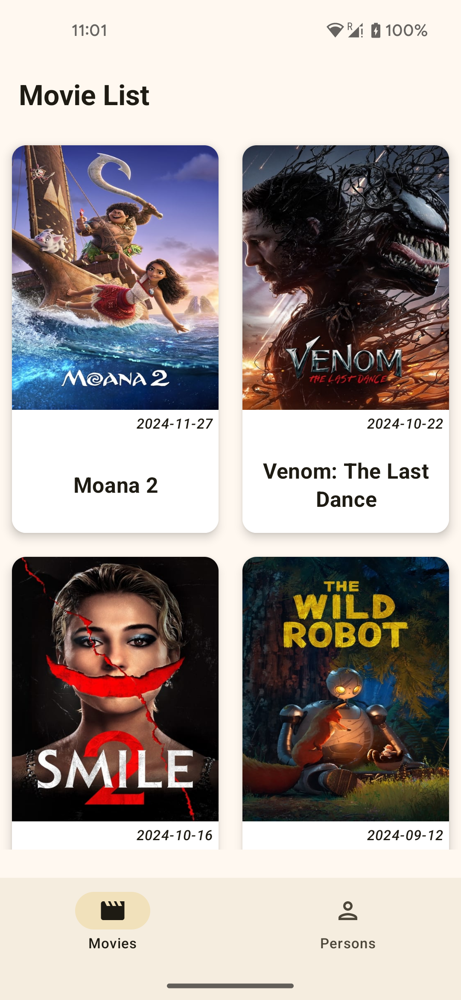
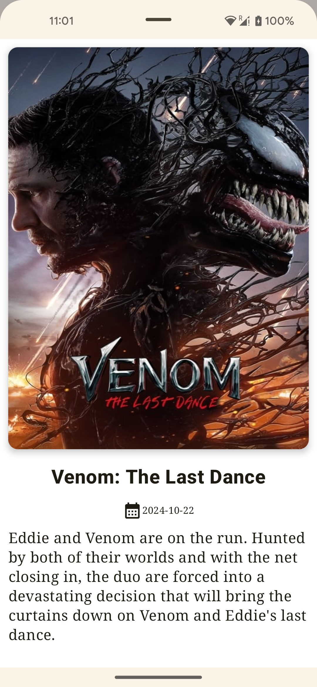
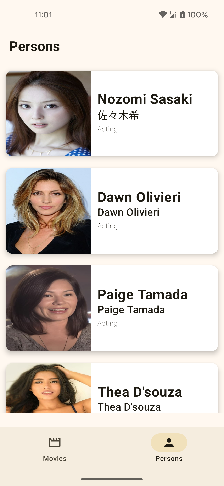

# Movie collections

## Description

Android app built with jetpack compose that displays data from the remote data source. The home screen will show a list of popular movies, each featuring an image and key details. When a user selects a movie, it will be navigated to a detail screen with more in-depth information about that movies. The project should adhere to SOLID principles and follow a clean architecture design pattern.

## Detailed Project Description

## 1. Technology Stack:

### 1.  UI Layer

* Jetpack Compose: For building declarative and reactive UIs.
* Material Design 3: Ensures a modern, visually appealing interface.

### 2.  Data Layer

* Retrofit: To fetch data from the remote API.
* Kotlin Coroutines & Flow: For asynchronous programming and reactive data streams.

### 3.  Dependency Injection

* Hilt: Simplifies dependency injection for a clean separation of concerns

### 4.  Kotlin
### 5.  mockk - for unit testing
### 6.  Coil - Image Loader library.
### 7.  API - https://api.themoviedb.org/3/movie/popular?api_key=

## 2. Features:

* Movies list View: This view displays a vertically scrolling list of movies fetched from a JSON endpoint.
* Detail View: This view displays the selected movie's details in a model bottom view layout.
* Persons View: This view displays a vertically scrolling list of popular people.

## 3. Architecture:

###   Clean Architecture Layers:
* Presentation Layer: Jetpack Compose UI interacting with ViewModels.
* Domain Layer: Use Cases handling the business logic.
* Data Layer: Repository pattern for data handling (remote and local).
####   SOLID Principles: Ensures code flexibility and maintainability.

## 4. Implementation:

* Shared ViewModel: A shared ViewModel is used to manage the state and share data between the screens.
* Type-Safe Navigation: The Navigation Component is used with type-safe arguments to navigate between screens.

## Design Pattern

* The application is developed using Test-Driven Development (TDD) and follows the Model-View-ViewModel (MVVM) design pattern.

## Further enhancements

* Furthermore cosmetics and refactoring is an endless thought.

#### Note: The application was created using the latest Android Studio version, Ladybug. It may not be fully compatible with older versions of Android Studio.

## Snapshots

